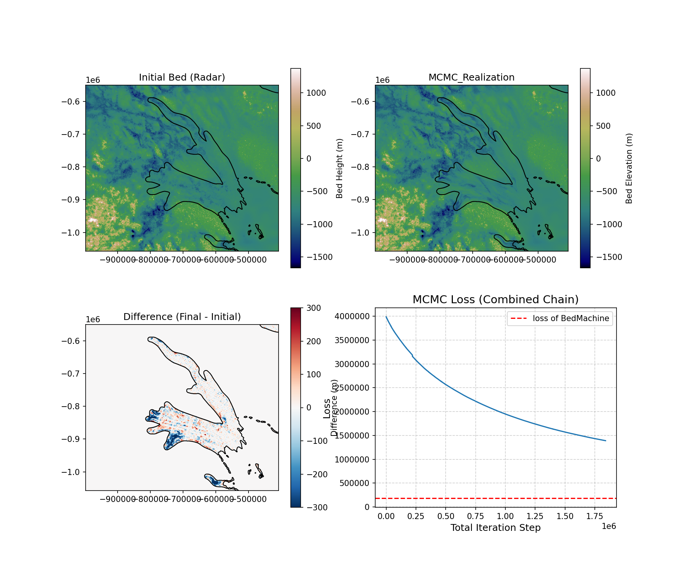

# Monte Carlo Markov Chain (MCMC) Geostatistical Inversion

This repository contains an implementation of the **Geostatistical Monte Carlo Markov Chain (MCMC)** method for **inversion and spatial simulation**. The project provides a Python-based framework designed to reproduce and extend the methodology described in the publication:

 **Reference:** [Geostatistical Monte Carlo Markov Chain for Subglacial Topography Inversion](https://doi.org/10.31223/X5SB2R)

## Purpose 

The main purpose of this repository is to implement and demonstrate the **geostatistical MCMC inversion technique**, enabling researchers to generate realistic **subglacial topographies** and other spatially correlated geological surfaces.  

This framework:

- Applies **Bayesian inference and MCMC sampling** to estimate hidden spatial fields based on observed data and prior geological knowledge.  
- Uses **variogram-based spatial modeling** to capture the statistical structure of the terrain.  
- Provides modular, flexible Python scripts and Jupyter notebooks to adapt the workflow for **different datasets, scales, and regions**.  

## Figures

#### MCMC Realization after 2.2m iterations

---

#### Difference between Initial vs Last iteration at High Velocity region

## Reproducibility

### Conda Virtual Environment & Installing dependencies + necessary packages

conda env create -f environment.yml

conda activate gstatsmcmc

jupyter lab

### If working on a node (e.g. HiperGator)

1. Navigate into your repo

cd MonteCarloMarkovChain

2. Create a virtual environment

python3 -m venv venv

3. Activate it

source venv/bin/activate

5. Installing dependencies

pip install --upgrade pip && pip install -r requirements.txt

## Library structure

Topography: Functionalities for subglacial topography application, including retrieving data, define high-velocity region, and calculating mass conservation

MCMC: Core geostatistics and Monte Carlo Markov Chain utilities

# Software 
Python 3.10.9 

<a href="https://github.com/NiyaShao/geostatisticalMCMC" target=blank_> gstatsmcmc - Niya Shao </a>