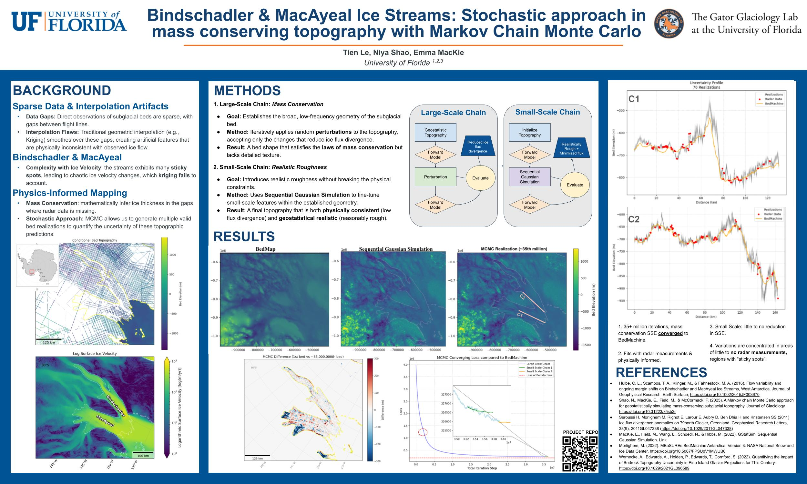
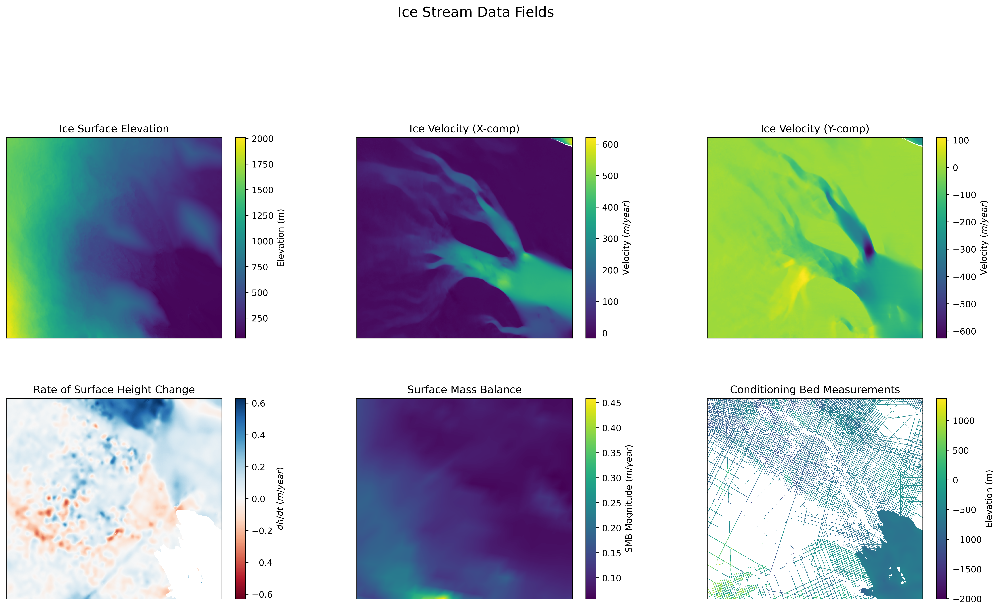
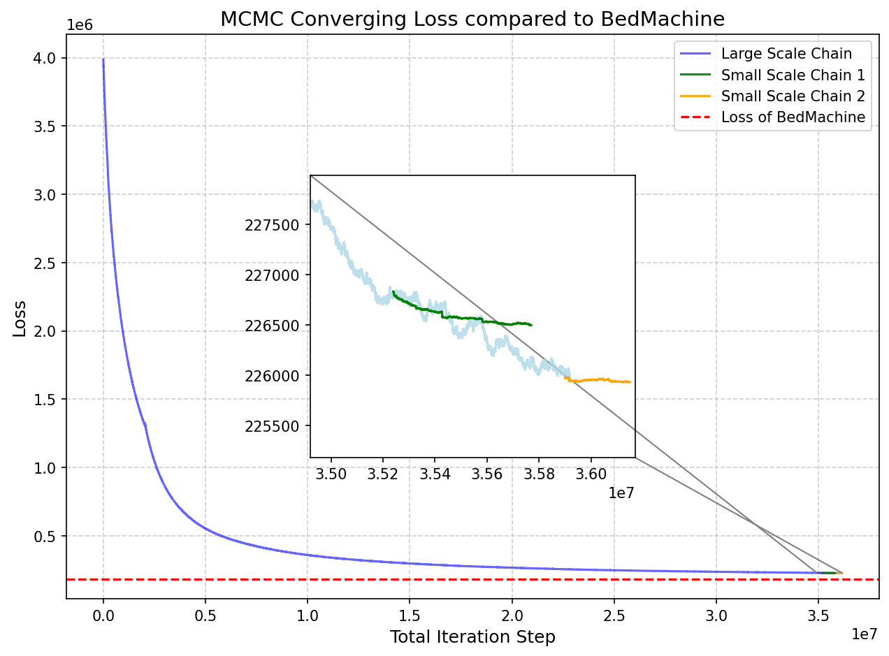
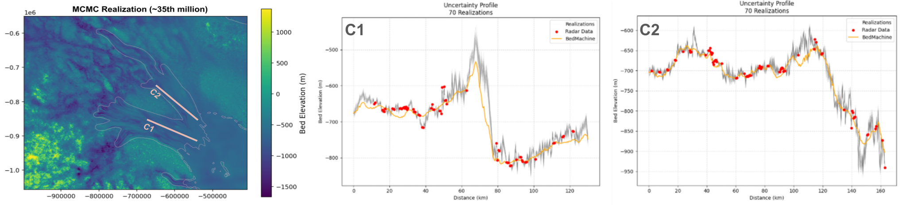

# MCMC Geostatistical Inversion: Bindschadler & MacAyeal Ice Streams

This repository contains an implementation of the Markov Chain Monte Carlo (MCMC) method for inversion and spatial simulation on the Bindschadler and MacAyeal Ice Streams (coordinates defined in config.py).

The project provides a Python framework designed to reproduce and extend the methodology described in Shao et al. (2025).

# Poster



# Overview 

## Scientific Motivation

The primary objective of this repository is to demonstrate geostatistical MCMC inversion techniques to generate physically informed and realistic subglacial topography.

Current baselines, such as BedMap and BedMachine, often rely on block kriging and similar interpolation methods. These techniques tend to smooth out details and extreme values found in radar measurements. Consequently, the resulting topography does not "conserve ice flux, and introduces anomalies [and artifacts] in the flux divergence" (Seroussi, 2011).

The Bindschadler and MacAyeal Ice Streams present unique challenges. They are characterized by "sticky spots" that control velocity changes and margin shifts, resulting in regions of both slow and fast-moving ice (Hulbe, 2016). Combining thickness data from BedMachine with high-resolution surface velocity data from InSAR in these regions often generates major artifacts, limiting the physical constraints available for standard kriging techniques.

## Key Features

- Bayesian Inference: Applies MCMC sampling to estimate hidden spatial fields based on observed data and prior geological knowledge.

- Spatial Modeling: Uses variogram-based modeling to capture the statistical structure of the terrain. In this study, we are using the **Matern Covariance Function**

- Scalability: Provides modular, flexible Python scripts and Jupyter notebooks adaptable for **different datasets, scales, and regions**.

- Validation: Includes tools to compare mass residual loss against BedMachine baselines.

## Methodology

To address these limitations, this framework utilizes the MCMC technique (Shao, 2025). We implement a dual-chain approach (Large Scale and Small Scale Chains) to produce Sequential Gaussian Simulations (Mackie, 2022).

This allows for the realization of subglacial topography that maintains realistic roughness under various constraints, including:

- Radar measurements
- Ice Surface Elevation
- Ice Velocity (X & Y)
- Rate of Surface Height change
- Surface Mass Balance
- Conditioning bed measurements (outside of study area)
- Grounded Ice
- Spatial Resolution of grid
- Mass conservation uncertainty (similar to BedMachine; Morlighem, 2022)

## Visualizations

#### Model Inputs Visualizations



*Figure 2: Geophysical Input and Conditioning Data for the Ice Stream Study Area. This figure displays key data fields used as input or for conditioning the subsurface model.
(Top Left) Ice Surface Elevation: Shows the topography of the ice surface, with a clear downhill gradient from the upper left (higher elevation) to the lower right.
(Top Middle) Ice Velocity (X-comp): Highlights the along-flow component of ice velocity, fast-flowing ice stream (darker purple/black areas correspond to low velocity, while the bright features show velocity up to 600 m/year).
(Top Right) Ice Velocity (Y-comp): Shows the across-flow component of ice velocity, revealing strong lateral shear and flow concentration, with both positive and negative velocity values (blue/yellow).
(Bottom Left) Rate of Surface Height Change (dh/dt): Indicates areas of thinning (red) and thickening (blue) of the ice. The main changes (both thinning and thickening) are concentrated in and around the high-velocity ice stream area.
(Bottom Middle) Surface Mass Balance: Shows the mass flux at the surface, which is relatively uniform across the domain compared to the dynamic fields.
(Bottom Right) Conditioning Bed Measurements: Shows the scattered, point-based observations of bed elevation that are used to condition or constrain the subsurface model.*

#### Topography Realization


*Figure 2: MCMC Bed Elevation Topography Realization 
(A) Reference bed topography from BedMap3.
(B) Reference bed topography from BedMachine by calculating sufurace - bed thickness from BedMachine, included high velocity region contour
(C) The final realization of the large-scale MCMC chain after $3.5 \times 10^7$ iterations; this state minimizes mass conservation loss to levels consistent with BedMachine standards (see loss convergence plot), and included high velocity region contour.

#### Difference between Initial vs Last iteration at High Velocity region


*Figure 3: Main changes concentrates in certain areas in high velocity region
(D) Radar flight tracks from the DEMOGORGON dataset overlaying the study area; the high-velocity region is delineated by the yellow contour (E) The residual difference in bed elevation (m) between the initial SGS realization (B) and the final MCMC output (C), highlighting the topographical adjustments made by the algorithm.*

#### Mass Conservation Loss over 35 million Iterations


*Evolution of the objective function (Loss) over 35 million iterations for the LargeScaleChain (blue line), and 2 Small Scale Chains for 2 million iterations each. The optimization reduces the loss from the initial SGS state down to the baseline loss threshold of BedMachine (red dashed line), demonstrating the algorithm's convergence toward a physically consistent bed topography.*

> Note: Divot at 0.3e7-th iteration happens after adding 2D Gaussian random field using FFT-based spectral synthesis (MCMC.py).

> For the future, with no restraint on resources and time, this study should be repeated with the same MCMC method throughout all iterations for consistency, and with multiple attempts for topography precision.

#### Cross Section of Bindshadler and MacAyeal Ice Streams


*Cross Section visualization of the ice streams, comparison between BedMachine, and the last 15 million iterations of Large Scale chain, where Mass Conservation Loss is minimized (Figure 4)*


> Note: Divot at 0.3e7-th iteration happens after adding 2D Gaussian random field using FFT-based spectral synthesis (MCMC.py).

> For the future, with no restraint on resources and time, this study should be repeated with the same MCMC method throughout all iterations for consistency, and with multiple attempts for topography precision.

## Reproducibility

### If you are working with a Conda/MiniForge Environment

```
conda env create -f environment.yml

conda activate gstatsmcmc

jupyter lab

```

### If working locally or on a node (e.g. HiperGator)

```
cd MonteCarloMarkovChain

python3 -m venv venv

source venv/bin/activate # MacOS or Linux
 .\venv\Scripts\activate # Windows 

pip install --upgrade pip && pip install -r requirements.txt # MacOS or Linux
pip install --upgrade pip; pip install -r requirements.txt # Windows

```

## Directories structure

```
├── 1.loading_studyArea.ipynb
│   └── Initializes the specific study region (Bindschadler & MacAyeal) by loading 
│       coordinates from config.py, importing BedMachine/InSAR data and setting up 
│       the computational grid.
│
├── 2.1_Stat_Model_Analysis.ipynb
│   └── Performs experimental variogram analysis to quantify spatial correlations 
│       and determines the best-fitting Covariance Function (e.g., Gaussian, Exponential) 
│       for the topography.
│
├── 2.2_Geostatistic_Analysis.ipynb
│   └── Conducts preliminary geostatistical modeling (e.g., Simple Kriging) to 
│       establish a baseline surface and error estimates before applying MCMC.
│   
|   
├── MCMC_chains/
│   ├── 3_LargeScaleChain.ipynb
│   │   └── The first stage of inversion: Optimizes for low-frequency trends and 
│   │       large-scale mass conservation to fix flux divergence anomalies.
│   │
│   └── 4_SmallScaleChain.ipynb
│       └── The second stage of inversion: Applies Sequential Gaussian Simulation (SGS) 
│           to reintroduce high-frequency texture and realistic roughness details.
│
├── gstatsmcmc/
│   └── Source code package containing core modules for kriging, MCMC sampling logic, 
│       physics constraints, and utility functions used by the notebooks above.
│
├── SGS_realizations/
│   └── Output directory storing the generated topography files and simulation 
│       results (e.g., .npy or .txt files).
│
├── visualizations/
│   └── Stores generated plots, including variograms, difference maps, and 
│       topography realizations.
│
├── config.py
│   └── Global configuration file containing study area coordinates, grid resolution, 
│       physical constants, and path variables.
│
└── data_weight.txt
    └── Text file defining the hyperparameter weights (lambdas) used to balance 
        priors, likelihoods, and physical constraints during the inversion process.

```

## Software 

Python 3.10.9 

### Related Repositories:
- <a href="https://github.com/NiyaShao/geostatisticalMCMC" target=blank_> gstatsmcmc - Niya Shao </a>

- <a href="https://gatorglaciology.github.io/gstatsimbook/4_Sequential_Gaussian_Simulation.html" target=blank_> GStatSim </a>


# References

- Hulbe, C. L., Scambos, T. A., Klinger, M., & Fahnestock, M. A. (2016). Flow variability and ongoing margin shifts
on Bindschadler and MacAyeal Ice Streams, West Antarctica. Journal of Geophysical Research: Earth Surface, https://doi.org/10.1002/2015JF003670
- Shao, N., MacKie, E., Field, M., & McCormack, F. (2025). A Markov chain Monte Carlo approach for geostatistically simulating mass-conserving subglacial topography. Journal of Glaciology. https://doi.org/10.31223/x5sb2r
- Seroussi H, Morlighem M, Rignot E, Larour E, Aubry D, Ben Dhia H and Kristensen SS (2011) Ice flux divergence anomalies on 79north Glacier, Greenland. Geophysical Research Letters, 38(9), 2011GL047338 (https://doi.org/10.1029/2011GL047338)
- MacKie, E., Field, M., Wang, L., Schoedl, N., & Hibbs, M. (2022). GStatSim: Sequential Gaussian Simulation. Link
- Morlighem, M. (2022). MEaSUREs BedMachine Antarctica, Version 3. NASA National Snow and Ice Data Center. https://doi.org/10.5067/FPSU0V1MWUB6
- Wernecke, A., Edwards, A., Holden, P., Edwards, T., Cornford, S. (2022). Quantifying the Impact of Bedrock Topography Uncertainty in Pine Island Glacier Projections for This Century. https://doi.org/10.1029/2021GL096589
