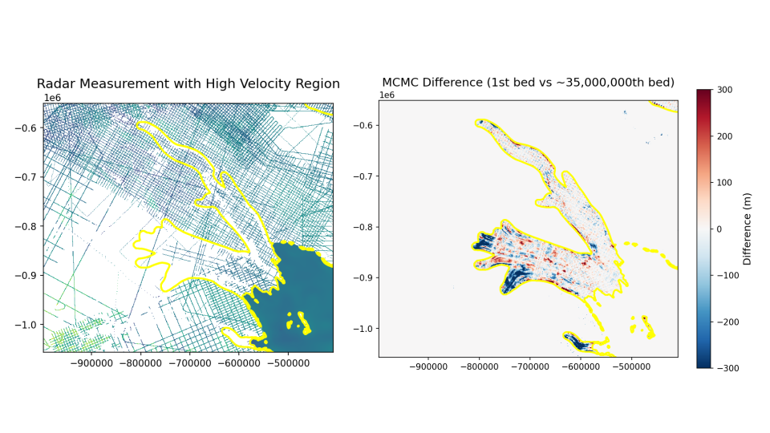
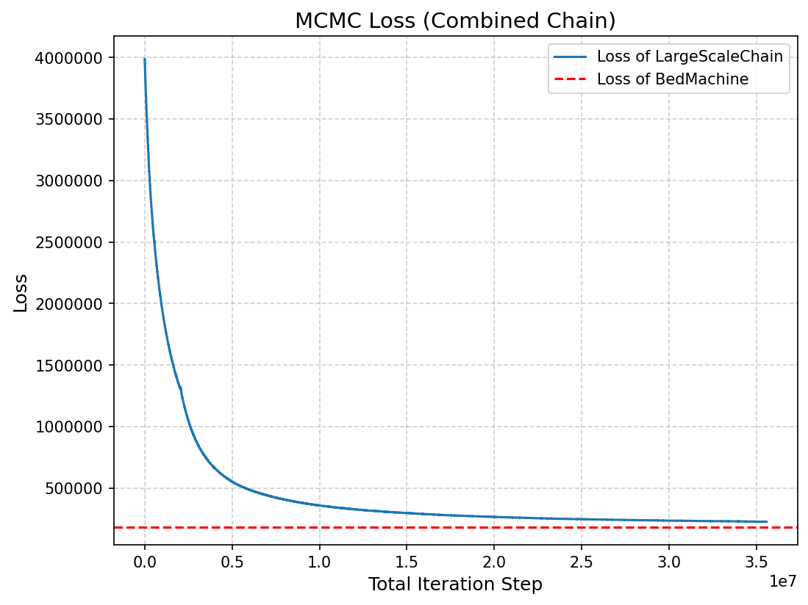

# MCMC Geostatistical Inversion: Bindschadler & MacAyeal Ice Streams

This repository contains an implementation of the Markov Chain Monte Carlo (MCMC) method for inversion and spatial simulation on the Bindschadler and MacAyeal Ice Streams (coordinates defined in config.py).

The project provides a Python framework designed to reproduce and extend the methodology described in Shao et al. (2025).

# Overview 

## Scientific Motivation

The primary objective of this repository is to demonstrate geostatistical MCMC inversion techniques to generate physically informed and realistic subglacial topography.

Current baselines, such as BedMap and BedMachine, often rely on block kriging and similar interpolation methods. These techniques tend to smooth out details and extreme values found in radar measurements. Consequently, the resulting topography does not "conserve ice flux, and introduces anomalies [and artifacts] in the flux divergence" (Seroussi, 2011).

The Bindschadler and MacAyeal Ice Streams present unique challenges. They are characterized by "sticky spots" that control velocity changes and margin shifts, resulting in regions of both slow and fast-moving ice (Hulbe, 2016). Combining thickness data from BedMachine with high-resolution surface velocity data from InSAR in these regions often generates major artifacts, limiting the physical constraints available for standard kriging techniques.

## Methodology

To address these limitations, this framework utilizes the MCMC technique (Shao, 2025). We implement a dual-chain approach (Large Scale and Small Scale Chains) to produce Sequential Gaussian Simulations (Mackie, 2022).

This allows for the realization of subglacial topography that maintains realistic roughness under various constraints, including:

- Radar measurements
- Ice Surface Elevation
- Ice Velocity (X & Y)
- Rate of Surface Height change
- Surface Mass Balance
- Conditioning bed measurements (outside of study area)
- Grounded Ice
- Spatial Resolution of grid
- Mass conservation uncertainty (similar to BedMachine; Morlighem, 2022)

## Key Features

- Bayesian Inference: Applies MCMC sampling to estimate hidden spatial fields based on observed data and prior geological knowledge.

- Spatial Modeling: Uses variogram-based modeling to capture the statistical structure of the terrain. In this study, we are using the **Matern Covariance Function**

- Scalability: Provides modular, flexible Python scripts and Jupyter notebooks adaptable for **different datasets, scales, and regions**.

- Validation: Includes tools to compare mass residual loss against BedMachine baselines.

## Visualizations

#### Comparing Realizations


---

#### Difference between Initial vs Last iteration at High Velocity region


#### Mass Conservation Loss over 35 million Iterations



## Reproducibility

### If you are working with a Conda/MiniForge Environment

```
conda env create -f environment.yml

conda activate gstatsmcmc

jupyter lab

```

### If working locally or on a node (e.g. HiperGator)

```
cd MonteCarloMarkovChain

python3 -m venv venv

source venv/bin/activate # MacOS or Linux
 .\venv\Scripts\activate # Windows 

pip install --upgrade pip && pip install -r requirements.txt # MacOS or Linux
pip install --upgrade pip; pip install -r requirements.txt # Windows

```

## Directories structure

```
├── 1.loading_studyArea.ipynb
│   └── Initializes the specific study region (Bindschadler & MacAyeal) by loading 
│       coordinates from config.py, importing BedMachine/InSAR data and setting up 
│       the computational grid.
│
├── 2.1_Stat_Model_Analysis.ipynb
│   └── Performs experimental variogram analysis to quantify spatial correlations 
│       and determines the best-fitting Covariance Function (e.g., Gaussian, Exponential) 
│       for the topography.
│
├── 2.2_Geostatistic_Analysis.ipynb
│   └── Conducts preliminary geostatistical modeling (e.g., Simple Kriging) to 
│       establish a baseline surface and error estimates before applying MCMC.
│   
|   
├── MCMC_chains/
│   ├── 3_LargeScaleChain.ipynb
│   │   └── The first stage of inversion: Optimizes for low-frequency trends and 
│   │       large-scale mass conservation to fix flux divergence anomalies.
│   │
│   └── 4_SmallScaleChain.ipynb
│       └── The second stage of inversion: Applies Sequential Gaussian Simulation (SGS) 
│           to reintroduce high-frequency texture and realistic roughness details.
│
├── gstatsmcmc/
│   └── Source code package containing core modules for kriging, MCMC sampling logic, 
│       physics constraints, and utility functions used by the notebooks above.
│
├── SGS_realizations/
│   └── Output directory storing the generated topography files and simulation 
│       results (e.g., .npy or .txt files).
│
├── visualizations/
│   └── Stores generated plots, including variograms, difference maps, and 
│       topography realizations.
│
├── config.py
│   └── Global configuration file containing study area coordinates, grid resolution, 
│       physical constants, and path variables.
│
└── data_weight.txt
    └── Text file defining the hyperparameter weights (lambdas) used to balance 
        priors, likelihoods, and physical constraints during the inversion process.

```

## Software 

Python 3.10.9 

### Related Repositories:
- <a href="https://github.com/NiyaShao/geostatisticalMCMC" target=blank_> gstatsmcmc - Niya Shao </a>

- <a href="https://gatorglaciology.github.io/gstatsimbook/4_Sequential_Gaussian_Simulation.html" target=blank_> GStatSim </a>


# References

- Shao, N., MacKie, E., Field, M., & McCormack, F. (2025). A Markov chain Monte Carlo approach for geostatistically simulating mass-conserving subglacial topography. Journal of Glaciology. https://doi.org/10.31223/x5sb2r

- MacKie, E., Field, M., Wang, L., Schoedl, N., & Hibbs, M. (2022). GStatSim: Sequential Gaussian Simulation. Link

- Morlighem, M. (2022). MEaSUREs BedMachine Antarctica, Version 3. NASA National Snow and Ice Data Center. https://doi.org/10.5067/FPSU0V1MWUB6

- Wernecke, A., Edwards, A., Holden, P., Edwards, T., Cornford, S. (2022). Quantifying the Impact of Bedrock Topography Uncertainty in Pine Island Glacier Projections for This Century. https://doi.org/10.1029/2021GL096589